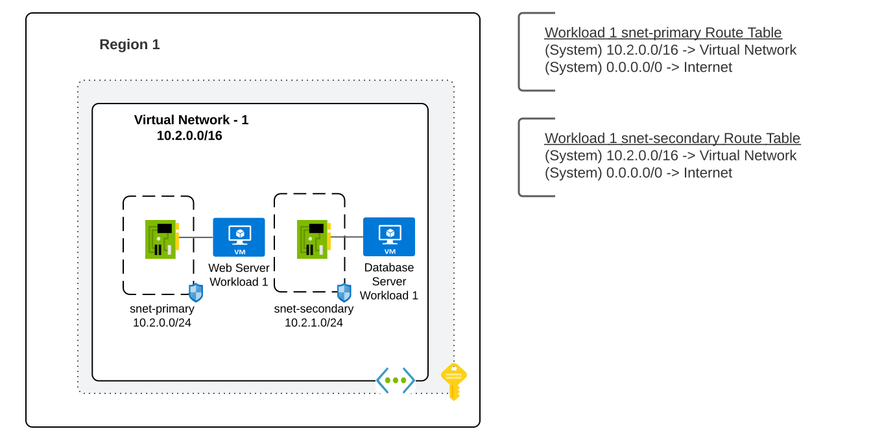
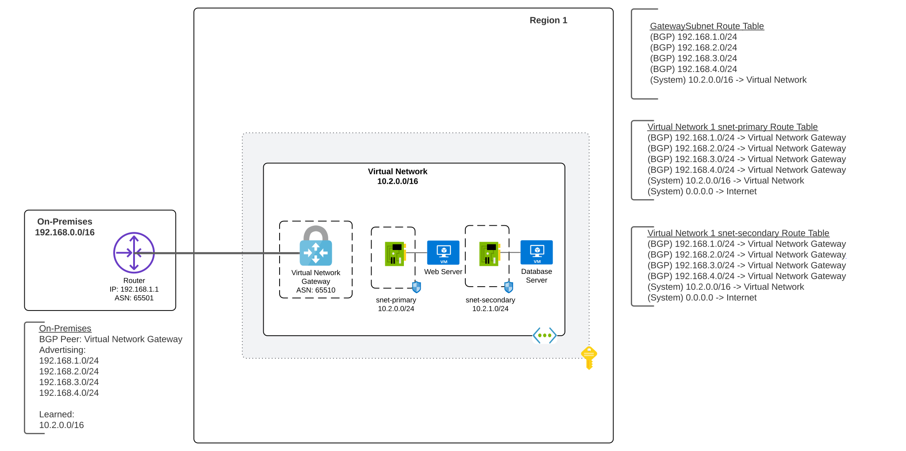
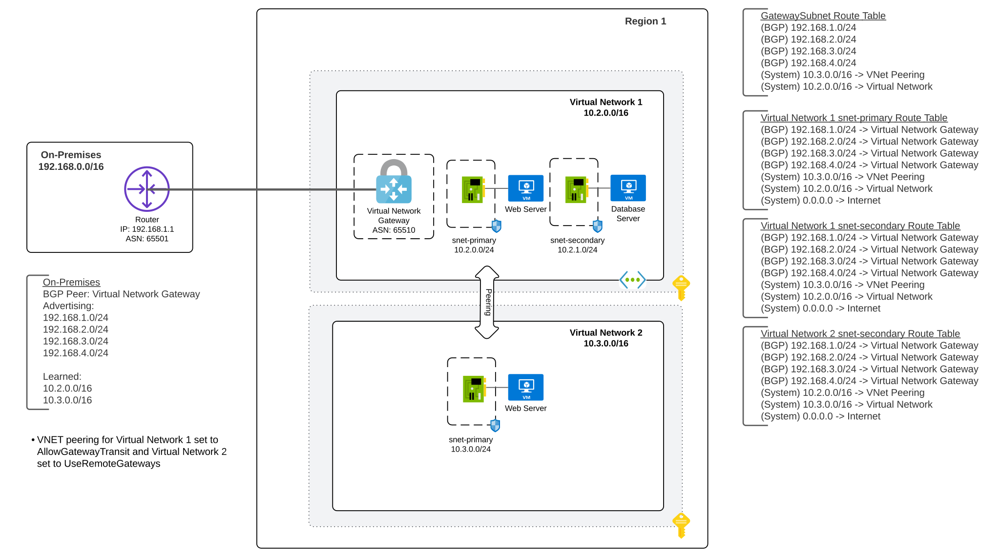
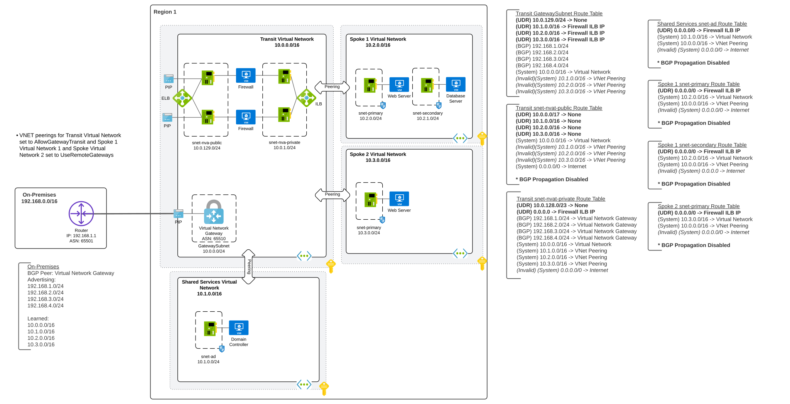
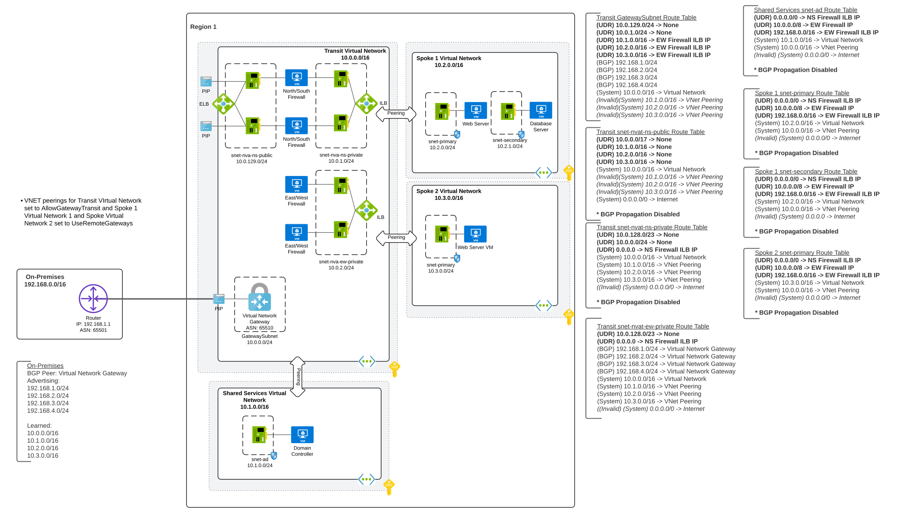

# (Work in progress) A Journey through Azure Networking

## Overview
Network is a critical component of a cloud. As an organization's cloud footprint scales and matures, the more complex the networking and routing becomes. While cloud providers such as Microsoft provide a means to enumerate [effective routes](https://docs.microsoft.com/en-us/azure/virtual-network/diagnose-network-routing-problem), it becomes a chore to visualize the effective routes across multiple virtual networks and subnets.

This repository contains a collection of diagrams that walk through the evolution of networking patterns organizations typically take when adopting Microsoft Azure. Each diagram includes a table displaying what the effective routes would look like for each of the virtual network subnets. It also includes important facts about each pattern and considerations organization's should be aware of if when they adopt a specific pattern.

**Note that in the patterns with firewalls, the firewalls are assumed to have a separate dedicated network interface in a management subnet. This is not shown in the diagrams.**

**Credit for blackhole routes in the advanced patterns to [Palo Alto](https://www.paloaltonetworks.com/resources/guides/azure-transit-vnet-deployment-guide).**

For detail on the traffic flows of the more complex network architectures listed here, reference [this repository](https://github.com/mattfeltonma/azure-networking-patterns).

## Sections
* [Single Virtual Network and Single Subnet](#single-vnet-and-single-subnet)
* [Single Virtual Network and Multiple Subnets](#single-vnet-and-multiple-subnets)
* [Single Virtual Network and Multiple Workloads](#single-vnet-and-multiple-workloads)
* [Single Virtaul Network and On-Premises Connectivity](#single-vnet-and-on-premises-connectivity)
* [Peered Virtual Networks and On-Premises Connectivity and Multiple Workloads](#peered-vnets-and-on-premises-connectivity-with-multiple-workloads)
* [Hub and Spoke With a Flat Network and Forced Tunneling](#hub-and-spoke-with-a-flat-network-and-forced-tunneling)
* [Hub and Spoke With East and West Firewall and Forced Tunneling](#hub-and-spoke-with-east-and-west-firewall-and-forced-tunneling)
* [Hub and Spoke With Single Firewall For North South East West](#hub-and-spoke-with-single-firewall-for-north-south-east-west)
* [Hub and Spoke With Dedicated North and South Firewall and Dedicated East and West Firewall](#hub-and-spoke-with-dedicated-north-and-south-firewall-and-dedicated-east-and-west-firewall)

## Single VNet And Single Subnet

In this pattern there is a single virtual network with a single subnet all resources are placed in. 

#### Benefits
* All virtual machines in the same virtual network can communicate with each other using default system routes.
* Virtual machine communication within the subnet can be mediated a network security group.

#### Considerations
* Scaling this pattern can be a significant problem because subnets cannot be resized once network interfaces are associated with them.
* Managing network security groups for intra-subnet traffic can be prone to misconfigurations.
* All resources have direct access to the Internet through the default system route.
* This pattern does not allow for connectivity back on-premises.

## Single VNet And Multiple Subnets

In this pattern there is a single virtual network with multiple subnets.

This is a common pattern for proof-of-concepts for a single workload where there is no requirement for on-premises connectivity.

#### Benefits
* All virtual machines in the same virtual network can communicate with each other using default system routes.
* Virtual machine communication between subnets can be mediated with network security groups.

#### Considerations
* All resources have direct access to the Internet through the default system route.
* This pattern does not allow for connectivity back on-premises.

## Single VNet And Multiple Workloads

In this pattern there is a single virtual network with multiple subnets hosting multiple workloads. 

#### Benefits
* Workload-to-workload communication can be mediated with network security groups.
* All virtual machines in the same virtual network can communicate with each other using default system routes.
* Virtual machine communication between subnets can be mediated with network security groups.

#### Considerations
* Resources for both workloads that require integration with the virtual network must be in the same subscription creating a single blast radius.
* It is not possible to restrict RBAC permissions on a per subnet basis within the same virtual network.
* All resources have direct access to the Internet through the default system route.
* This pattern does not allow for connectivity back on-premises.

## Single VNet And On-Premises Connectivity

In this pattern there is a single virtual network with multiple subnets and the workloads require on-premises connectivity. 

This is a common pattern for proof-of-concepts for a single workload where on-premises connectivity is required.

### Benefits
* On-premises connectivity is provided by a Virtual Network Gateway configured with either a site-to-site VPN or ExpressRoute connection. Routes can be exchanged between on-premises and Azure using BGP.
* All virtual machines in the same virtual network can communicate with each other using default system routes.
* Virtual machine communication between subnets can be mediated with network security groups.

#### Considerations
* The workload and on-premises connectivity resources must be within the same subscription.
* All resources have direct access to the Internet through the default system route.

## Peered VNets And On-Premises Connectivity With Multiple Workloads

In this pattern each workload is its own virtual network and requires on-premises connectivity. 

#### Benefts
* On-premises connectivity is provided by a Virtual Network Gateway configured with either a site-to-site VPN or ExpressRoute connection. Routes can be exchanged between on-premises and Azure using BGP.
* On-premises connectivity for the peered virtual network is provided by [gateway transit](https://docs.microsoft.com/en-us/azure/vpn-gateway/vpn-gateway-peering-gateway-transit).
* Workload resources can be placed in separate subscriptions which creates a smaller blast radius.
* All virtual machines in the separate peered virtual networks can communicate with each other using default system routes.
* Virtual machine communication between subnets in the separate peered virtual networks can be mediated with network security groups.
* All virtual machines in the same virtual network can communicate with each other using default system routes.
* Virtual machine communication between subnets in the same virtual network can be mediated with network security groups.

#### Considerations
* The workload and on-premises connectivity resources must be within the same subscription.
* All resources have direct access to the Internet through the default system route.

## Hub And Spoke With A Flat Network And Forced Tunneling

In this pattern there is a dedicated virtual network used for on-premises connectivity which is shared with each workload that each have their own dedicated virtual network and there is a requirement to send Internet-bound traffic back on-premises for inspection, mediation, and/or logging.

This is a common pattern for organizations new to Azure that may have a significant capital investment in security appliances on-premises that are not yet fully depreciated and are comfortable mediating network traffic between workloads using network security groups.

#### Benefits
* All resources are forced to route Internet-bound traffic back on-premises where it can be mediated, inspected, and/or logged.
* Workloads have dedicated subscriptions containing their virtual network and workload resources creating separate blast radiuses.
* The on-premises connectivity resources are in a dedicated subscription creating a separate blast radius.
* All virtual machines in the separate peered virtual networks can communicate with each other through the Virtual Network Gateway (VPN) or MSEE (Microsoft Enterprise Edge) router (ExpressRoute).
* On-premises connectivity is provided by a Virtual Network Gateway configured with either a site-to-site VPN or ExpressRoute connection. Routes can be exchanged between on-premises and Azure using BGP.
* On-premises connectivity for the peered virtual network is provided by [gateway transit](https://docs.microsoft.com/en-us/azure/vpn-gateway/vpn-gateway-peering-gateway-transit).
* Virtual machine communication between subnets in the separate peered virtual networks can be mediated with network security groups.
* All virtual machines in the same virtual network can communicate with each other using default system routes.
* Virtual machine communication between subnets in the same virtual network can be mediated with network security groups.

#### Considerations
* This pattern creates a flat network where only network security groups can be used to mediate traffic between workloads.
* Additional costs and latency will be incurred for egressing Internet-bound traffic back on-premises.

## Hub And Spoke With East and West Firewall And Forced Tunneling

In this pattern there is a dedicated virtual network used for on-premises connectivity which is shared with each workload that each have their own dedicated virtual network and there is a requirement to send Internet-bound traffic back on-premises for inspection, mediation, filtering, and/or logging. There is also a requirement for inspection, mediation, and/or logging for traffic between on-premises and workloads and for traffic between workloads but these activities must be performed by a firewall in Azure.

This pattern also uses a dedicated virtual network in a dedicated subscription for shared infrastructure services. These services can include Microsoft Active Directory, patching or update services, or logging services.

This is a common pattern for organizations new to Azure that may have a significant capital investment in security appliances on-premises that are not yet fully depreciated but want mediation, inspection, and/or centralized logging between workloads which is provided by a firewall in Azure.

Organizations are encouraged to explore [Azure Virtual WAN](https://docs.microsoft.com/en-us/azure/virtual-wan/virtual-wan-about) in place of this pattern due to the additional capabilities and managed nature of Virtual WAN. There are significant considerations to using [Azure Virtual WAN](https://docs.microsoft.com/en-us/azure/virtual-wan/virtual-wan-faq) and organizations are encouraged to consult with their Microsoft account teams or trusted Microsoft partners before moving ahead with Azure Virtual WAN.

#### Benefits
* The firewall in Azure receives all traffic from workloads destined for on-premises, other workloads, or the Internet and can be used to centrally mediate, inspect, and/or log traffic.
* All Internet-bound traffic is forced to route back on-premises where it can be mediated, inspected, and/or logged.
* Shared infrastructure services added to Azure reduce the for workloads to go back on-premises for these services reducing network costs, latency, and mitigate impact of lost connectivity to on-premises.
* Shared infrastructure services have a dedicated subscription containing its own virtual network and resources creating a separate blast radius.
* Workloads have dedicated subscriptions containing their virtual network and workload resources creating separate blast radiuses.
* The on-premises connectivity and network security appliances resources are in a dedicated subscription creating a separate blast radius.
* All virtual machines in the separate peered virtual networks can communicate with each other through the Virtual Network Gateway (VPN) or MSEE (Microsoft Enterprise Edge) router (ExpressRoute).
* On-premises connectivity is provided by a Virtual Network Gateway configured with either a site-to-site VPN or ExpressRoute connection. Routes can be exchanged between on-premises and Azure using BGP.
* Virtual machine communication between subnets in the separate peered virtual networks can be mediated with network security groups.
* All virtual machines in the same virtual network can communicate with each other using default system routes.
* Virtual machine communication between subnets in the same virtual network can be mediated with network security groups.

#### Considerations
* Additional costs of the firewall running in Azure.
* Additional costs and latency will be incurred for egressing Internet-bound traffic back on-premises.

## Hub And Spoke With Single Firewall For North South East West

In this pattern there is a dedicated virtual network used for on-premises connectivity which is shared with each workload that each have their own dedicated virtual network. There is requirement for Internet-bound traffic, traffic between on-premises and Azure, and traffic between workloads in Azure to be mediated, inspected, and/or centrally logged by firewalls in Azure.

This pattern also uses a dedicated virtual network in a dedicated subscription for shared infrastructure services. These services can include Microsoft Active Directory, patching or update services, or logging services.

This is one of the more common patterns for organizations using Azure.

Organizations are encouraged to explore [Azure Virtual WAN](https://docs.microsoft.com/en-us/azure/virtual-wan/virtual-wan-about) in place of this pattern due to the additional capabilities and managed nature of Virtual WAN. There are significant considerations to using [Azure Virtual WAN](https://docs.microsoft.com/en-us/azure/virtual-wan/virtual-wan-faq) and organizations are encouraged to consult with their Microsoft account teams or trusted Microsoft partners before moving ahead with Azure Virtual WAN.

#### Benefits
* The firewall in Azure receives all traffic from workloads destined for on-premises, other workloads, or the Internet and can be used to centrally mediate, inspect, and/or log traffic.
* All Internet-bound traffic is egressed directly out of Azure reducing networking complexity.
* Shared infrastructure services added to Azure reduce the for workloads to go back on-premises for these services reducing network costs, latency, and mitigate impact of lost connectivity to on-premises.
* Shared infrastructure services have a dedicated subscription containing its own virtual network and resources creating a separate blast radius.
* Workloads have dedicated subscriptions containing their virtual network and workload resources creating separate blast radiuses.
* The on-premises connectivity and network security appliances resources are in a dedicated subscription creating a separate blast radius.
* All virtual machines in the separate peered virtual networks can communicate with each other through the Virtual Network Gateway (VPN) or MSEE (Microsoft Enterprise Edge) router (ExpressRoute).
* On-premises connectivity is provided by a Virtual Network Gateway configured with either a site-to-site VPN or ExpressRoute connection. Routes can be exchanged between on-premises and Azure using BGP.
* Virtual machine communication between subnets in the separate peered virtual networks can be mediated with network security groups.
* All virtual machines in the same virtual network can communicate with each other using default system routes.
* Virtual machine communication between subnets in the same virtual network can be mediated with network security groups.

#### Considerations
* All north/south/east/west traffic flows through a single set of firewalls which could create a bottleneck.
* Additional costs of the firewall running in Azure.

## Hub And Spoke With Dedicated North And South Firewall And Dedicated East And West Firewall

In this pattern there is a dedicated virtual network used for on-premises connectivity which is shared with each workload that each have their own dedicated virtual network. There is requirement for Internet-bound traffic, traffic between on-premises and Azure, and traffic between workloads in Azure to be mediated, inspected, and/or centrally logged by firewalls in Azure. There is a separate firewall stack for north/south traffic and another for east/west traffic.

This pattern also uses a dedicated virtual network in a dedicated subscription for shared infrastructure services. These services can include Microsoft Active Directory, patching or update services, or logging services.

This is one of the more common patterns for organizations using Azure that have a significant amount of internal and externallly facing workloads and would like to mitigate the risk of a bottleneck.

Organized are encouraged to explore [Azure Virtual WAN](https://docs.microsoft.com/en-us/azure/virtual-wan/virtual-wan-about) in place of this pattern due to the additional capabilities and managed nature of Virtual WAN. There are significant considerations to using [Azure Virtual WAN](https://docs.microsoft.com/en-us/azure/virtual-wan/virtual-wan-faq) and organizations are encouraged to consult with their Microsoft account teams or trusted Microsoft partners before moving ahead with Azure Virtual WAN.

#### Benefits
* North/south and east/west traffic is distributed to two separate firewall stacks reducing the risk of a bottleneck.
* All Internet-bound traffic is egressed directly out of Azure reducing networking complexity.
* Shared infrastructure services added to Azure reduce the for workloads to go back on-premises for these services reducing network costs, latency, and mitigate impact of lost connectivity to on-premises.
* Shared infrastructure services have a dedicated subscription containing its own virtual network and resources creating a separate blast radius.
* Workloads have dedicated subscriptions containing their virtual network and workload resources creating separate blast radiuses.
* The on-premises connectivity and network security appliances resources are in a dedicated subscription creating a separate blast radius.
* All virtual machines in the separate peered virtual networks can communicate with each other through the Virtual Network Gateway (VPN) or MSEE (Microsoft Enterprise Edge) router (ExpressRoute).
* On-premises connectivity is provided by a Virtual Network Gateway configured with either a site-to-site VPN or ExpressRoute connection. Routes can be exchanged between on-premises and Azure using BGP.
* Virtual machine communication between subnets in the separate peered virtual networks can be mediated with network security groups.
* All virtual machines in the same virtual network can communicate with each other using default system routes.
* Virtual machine communication between subnets in the same virtual network can be mediated with network security groups.

#### Considerations
* Carving out IP address blocks for Azure must be well planned to avoid frequent changes to static routes.
* Routing can become complex.
* Additional costs of running multiple sets of firewalls.

