# A Journey through Azure Networking

## Overview
Organizations often begin the cloud journey with simple requirements. These requirements grow as an organization scales, matures, and migrates critical data and workloads. As more requirements are introduced, the architecture of the an organization's cloud deployment becomes more complex.

This repository contains a collection of core networking patterns starting from basic to advanced. The goal is to assist customers with picking the right pattern for their stage of the journey. Each pattern includes a summary, benefits and considerations, and diagrams providing examples of the patterns and what the route tables could look like.

For the purposes of this repository, north and south traffic is traffic ingressing or egressing to the Internet. East and west is traffic ingressing or egressing between on-premises and Azure or between workloads running in Azure.

This repository now includes patterns for Azure Virtual WAN (VWAN). Those patterns include a considerable amount of detail to help educate customers on routing within VWAN. Due to the detail, the diagrams are best viewed by downloading the diagrams from this repository. These are contained in the [images folder](/images/).

**Note that in the patterns with firewalls, the firewalls are assumed to have a separate dedicated network interface in a management subnet. This is not shown in the diagrams.**

**Note that these patterns in the VWAN section are not inclusive of all VWAN patterns. The patterns included are the patterns the author believes most viable and appropriate. Customers should work with their trusted Microsoft partners and account team if these patterns do not work for their use cases.**

**Reference [Palo Alto](https://www.paloaltonetworks.com/resources/guides/azure-transit-vnet-deployment-guide) for great detail on firewall architecture, design, and implementation guidance in Azure.**

For detail on the traffic flows of the more complex network architectures listed here, reference [this repository](https://github.com/mattfeltonma/azure-networking-patterns).

## Sections
###  General
* [Single Virtual Network and Single Subnet](#single-vnet-and-single-subnet)
* [Single Virtual Network and Multiple Subnets](#single-vnet-and-multiple-subnets)
* [Single Virtual Network and Multiple Workloads](#single-vnet-and-multiple-workloads)
* [Single Virtual Network and On-Premises Connectivity](#single-vnet-and-on-premises-connectivity)
* [Peered Virtual Networks and On-Premises Connectivity and Multiple Workloads](#peered-vnets-and-on-premises-connectivity-with-multiple-workloads)

### Hub and Spoke
* [Hub and Spoke With a Flat Network and Forced Tunneling](#hub-and-spoke-with-a-flat-network-and-forced-tunneling)
* [Hub and Spoke With East and West Firewall and Forced Tunneling](#hub-and-spoke-with-east-and-west-firewall-and-forced-tunneling)
* [Hub and Spoke With Single Firewall For North South East West](#hub-and-spoke-with-single-firewall-for-north-south-east-west)
* [Hub and Spoke With Dedicated North and South Firewall and Dedicated East and West Firewall](#hub-and-spoke-with-dedicated-north-and-south-firewall-and-dedicated-east-and-west-firewall)
* [Hub and Spoke With Dedicated North and South Firewall and Dedicated East and West Firewall In Seperate Virtual Networks](#hub-and-spoke-with-dedicated-north-and-south-firewall-and-dedicated-east-and-west-firewall-in-seperate-virtual-networks)

### Virtual WAN
* [Single region VWAN hub](#vwan---single-region-vwan-hub)
* [Single region VWAN hub with single branch](#vwan---single-region-vwan-hub-with-single-branch)
* [Single region VWAN Hub with multiple branches](#vwan---single-region-vwan-hub-with-multiple-branches)
* [Multiple region VWAN Hubs with multiple branches connected to a single hub](#vwan---multiple-region-vwan-hubs-with-multiple-branches-connected-to-a-single-hub)
* [Multiple region VWAN Hubs with multiple branches connected to multiple hubs](#vwan---multiple-region-vwan-hubs-with-multiple-branches-connected-to-multiple-hubs)
* [Multiple region VWAN Hubs with multiple branches connected to multiple hubs for redundancy](#vwan---multiple-region-vwan-hubs-with-multiple-branches-connected-to-multiple-hubs-for-redundancy)
* [Multiple region VWAN Secure Hubs with multiple branches connected to multiple hubs for redundancy and north and south firewall using routing policies](#vwan---multiple-region-vwan-secure-hubs-with-multiple-branches-connected-to-multiple-hubs-for-redundancy-and-north-and-south-firewall-using-routing-policies)
* [Multiple region VWAN Secure Hubs with multiple branches connected to multiple hubs for redundancy and north south east west firewall using routing policies](#vwan---multiple-region-vwan-secure-hubs-with-multiple-branches-connected-to-multiple-hubs-for-redundancy-and-north-south-east-west-firewall-using-custom-routing---option-1)

* [Multiple region VWAN Secure Hubs with multiple branches connected to multiple hubs for redundancy and north south east west firewall using custom routing - option 1](#vwan---multiple-region-vwan-secure-hubs-with-multiple-branches-connected-to-multiple-hubs-for-redundancy-and-north-south-east-west-firewall-using-custom-routing---option-1)
* [Multiple region VWAN Secure Hubs with multiple branches connected to multiple hubs for redundancy and north south east west firewall using custom routing - option 2]((#vwan---multiple-region-vwan-secure-hubs-with-multiple-branches-connected-to-multiple-hubs-for-redundancy-and-north-south-east-west-firewall-using-custom-routing---option-2))

## Patterns
### Single VNet And Single Subnet

In this pattern there is a single virtual network with a single subnet all resources are placed in. 

#*Benefits*
* All virtual machines in the same virtual network can communicate with each other using default system routes.
* Virtual machine communication within the subnet can be mediated a network security group.

#*Considerations*
* Scaling this pattern can be a significant problem because subnets cannot be resized once network interfaces are associated with them.
* Managing network security groups for intra-subnet traffic can be prone to misconfigurations.
* All resources have direct access to the Internet through the default system route.
* This pattern does not allow for connectivity back on-premises.

### Single VNet And Multiple Subnets

In this pattern there is a single virtual network with multiple subnets.

This is a common pattern for proof-of-concepts for a single workload where there is no requirement for on-premises connectivity.

*Benefits*
* All virtual machines in the same virtual network can communicate with each other using default system routes.
* Virtual machine communication between subnets can be mediated with network security groups.

*Considerations*
* All resources have direct access to the Internet through the default system route.
* This pattern does not allow for connectivity back on-premises.

### Single VNet And Multiple Workloads

In this pattern there is a single virtual network with multiple subnets hosting multiple workloads. 

*Benefits*
* Workload-to-workload communication can be mediated with network security groups.
* All virtual machines in the same virtual network can communicate with each other using default system routes.
* Virtual machine communication between subnets can be mediated with network security groups.

*Considerations*
* Resources for both workloads that require integration with the virtual network must be in the same subscription creating a single blast radius.
* It is not possible to restrict RBAC permissions on a per subnet basis within the same virtual network.
* All resources have direct access to the Internet through the default system route.
* This pattern does not allow for connectivity back on-premises.

### Single VNet And On-Premises Connectivity

In this pattern there is a single virtual network with multiple subnets and the workloads require on-premises connectivity. 

This is a common pattern for proof-of-concepts for a single workload where on-premises connectivity is required.

*Benefits*
* On-premises connectivity is provided by a Virtual Network Gateway configured with either a site-to-site VPN or ExpressRoute connection. Routes can be exchanged between on-premises and Azure using BGP.
* All virtual machines in the same virtual network can communicate with each other using default system routes.
* Virtual machine communication between subnets can be mediated with network security groups.

*Considerations*
* The workload and on-premises connectivity resources must be within the same subscription.
* All resources have direct access to the Internet through the default system route.

### Peered VNets And On-Premises Connectivity With Multiple Workloads

In this pattern each workload is its own virtual network and requires on-premises connectivity. 

#### Benefts
* On-premises connectivity is provided by a Virtual Network Gateway configured with either a site-to-site VPN or ExpressRoute connection. Routes can be exchanged between on-premises and Azure using BGP.
* On-premises connectivity for the peered virtual network is provided by [gateway transit](https://docs.microsoft.com/en-us/azure/vpn-gateway/vpn-gateway-peering-gateway-transit).
* Workload resources can be placed in separate subscriptions which creates a smaller blast radius.
* All virtual machines in the separate peered virtual networks can communicate with each other using default system routes.
* Virtual machine communication between subnets in the separate peered virtual networks can be mediated with network security groups.
* All virtual machines in the same virtual network can communicate with each other using default system routes.
* Virtual machine communication between subnets in the same virtual network can be mediated with network security groups.

*Considerations*
* The workload and on-premises connectivity resources must be within the same subscription.
* All resources have direct access to the Internet through the default system route.

### Hub And Spoke With A Flat Network And Forced Tunneling
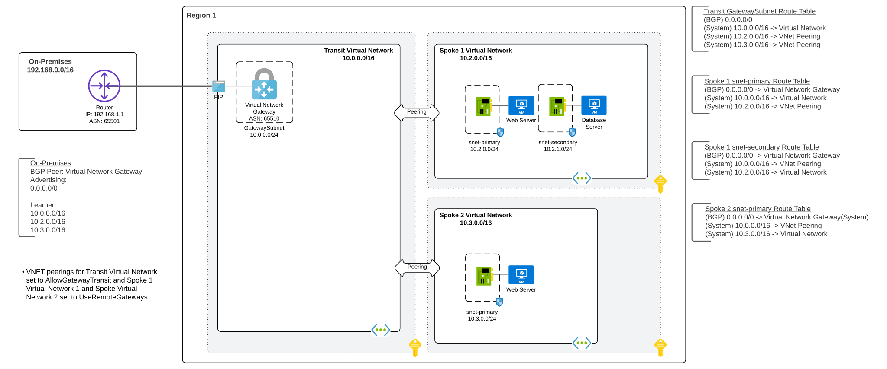

In this pattern there is a dedicated virtual network used for on-premises connectivity which is shared with each workload that each have their own dedicated virtual network and there is a requirement to send Internet-bound traffic back on-premises for inspection, mediation, and/or logging.

This is a common pattern for organizations new to Azure that may have a significant capital investment in security appliances on-premises that are not yet fully depreciated and are comfortable mediating network traffic between workloads using network security groups.

*Benefits*
* All resources are forced to route Internet-bound traffic back on-premises where it can be mediated, inspected, and/or logged.
* Workloads have dedicated subscriptions containing their virtual network and workload resources creating separate blast radiuses.
* The on-premises connectivity resources are in a dedicated subscription creating a separate blast radius.
* All virtual machines in the separate peered virtual networks can communicate with each other through the Virtual Network Gateway (VPN) or MSEE (Microsoft Enterprise Edge) router (ExpressRoute).
* On-premises connectivity is provided by a Virtual Network Gateway configured with either a site-to-site VPN or ExpressRoute connection. Routes can be exchanged between on-premises and Azure using BGP.
* On-premises connectivity for the peered virtual network is provided by [gateway transit](https://docs.microsoft.com/en-us/azure/vpn-gateway/vpn-gateway-peering-gateway-transit).
* Virtual machine communication between subnets in the separate peered virtual networks can be mediated with network security groups.
* All virtual machines in the same virtual network can communicate with each other using default system routes.
* Virtual machine communication between subnets in the same virtual network can be mediated with network security groups.

*Considerations*
* This pattern creates a flat network where only network security groups can be used to mediate traffic between workloads.
* Additional costs and latency will be incurred for egressing Internet-bound traffic back on-premises.

### Hub And Spoke With East and West Firewall And Forced Tunneling
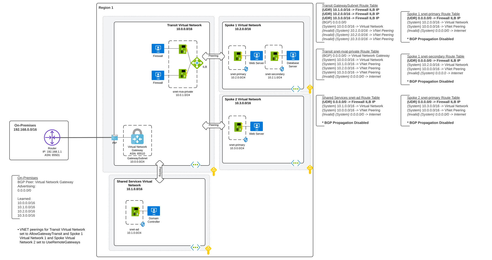

In this pattern there is a dedicated virtual network used for on-premises connectivity which is shared with each workload that each have their own dedicated virtual network and there is a requirement to send Internet-bound traffic back on-premises for inspection, mediation, filtering, and/or logging. There is also a requirement for inspection, mediation, and/or logging for traffic between on-premises and workloads and for traffic between workloads but these activities must be performed by a firewall in Azure.

This pattern also uses a dedicated virtual network in a dedicated subscription for shared infrastructure services. These services can include Microsoft Active Directory, patching or update services, or logging services.

This is a common pattern for organizations new to Azure that may have a significant capital investment in security appliances on-premises that are not yet fully depreciated but want mediation, inspection, and/or centralized logging between workloads which is provided by a firewall in Azure.

*Benefits*
* The firewall in Azure receives all traffic from workloads destined for on-premises, other workloads, or the Internet and can be used to centrally mediate, inspect, and/or log traffic.
* All Internet-bound traffic is forced to route back on-premises where it can be mediated, inspected, and/or logged.
* Shared infrastructure services added to Azure reduce the for workloads to go back on-premises for these services reducing network costs, latency, and mitigate impact of lost connectivity to on-premises.
* Shared infrastructure services have a dedicated subscription containing its own virtual network and resources creating a separate blast radius.
* Workloads have dedicated subscriptions containing their virtual network and workload resources creating separate blast radiuses.
* The on-premises connectivity and network security appliances resources are in a dedicated subscription creating a separate blast radius.
* All virtual machines in the separate peered virtual networks can communicate with each other through the Virtual Network Gateway (VPN) or MSEE (Microsoft Enterprise Edge) router (ExpressRoute).
* On-premises connectivity is provided by a Virtual Network Gateway configured with either a site-to-site VPN or ExpressRoute connection. Routes can be exchanged between on-premises and Azure using BGP.
* Virtual machine communication between subnets in the separate peered virtual networks can be mediated with network security groups.
* All virtual machines in the same virtual network can communicate with each other using default system routes.
* Virtual machine communication between subnets in the same virtual network can be mediated with network security groups.

*Considerations*
* Additional costs of the firewall running in Azure.
* Additional costs and latency will be incurred for egressing Internet-bound traffic back on-premises.

### Hub And Spoke With Single Firewall For North South East West

In this pattern there is a dedicated virtual network used for on-premises connectivity which is shared with each workload that each have their own dedicated virtual network. There is requirement for Internet-bound traffic, traffic between on-premises and Azure, and traffic between workloads in Azure to be mediated, inspected, and/or centrally logged by firewalls in Azure.

This pattern also uses a dedicated virtual network in a dedicated subscription for shared infrastructure services. These services can include Microsoft Active Directory, patching or update services, or logging services.

This is one of the more common patterns for organizations using Azure.

*Benefits*
* Traffic between the interface in the public subnet and private subnet is blackholed to help create a DMZ-like design.
* The firewall in Azure receives all traffic from workloads destined for on-premises, other workloads, or the Internet and can be used to centrally mediate, inspect, and/or log traffic.
* All Internet-bound traffic is egressed directly out of Azure reducing networking complexity.
* Shared infrastructure services added to Azure reduce the for workloads to go back on-premises for these services reducing network costs, latency, and mitigate impact of lost connectivity to on-premises.
* Shared infrastructure services have a dedicated subscription containing its own virtual network and resources creating a separate blast radius.
* Workloads have dedicated subscriptions containing their virtual network and workload resources creating separate blast radiuses.
* The on-premises connectivity and network security appliances resources are in a dedicated subscription creating a separate blast radius.
* All virtual machines in the separate peered virtual networks can communicate with each other through the Virtual Network Gateway (VPN) or MSEE (Microsoft Enterprise Edge) router (ExpressRoute).
* On-premises connectivity is provided by a Virtual Network Gateway configured with either a site-to-site VPN or ExpressRoute connection. Routes can be exchanged between on-premises and Azure using BGP.
* Virtual machine communication between subnets in the separate peered virtual networks can be mediated with network security groups.
* All virtual machines in the same virtual network can communicate with each other using default system routes.
* Virtual machine communication between subnets in the same virtual network can be mediated with network security groups.

*Considerations*
* All north/south/east/west traffic flows through a single set of firewalls which could create a bottleneck.
* Additional costs of the firewall running in Azure.

### Hub And Spoke With Dedicated North And South Firewall And Dedicated East And West Firewall

In this pattern there is a dedicated virtual network used for on-premises and Internet connectivity which is shared with each workload that each have their own dedicated virtual network. There is requirement for Internet-bound traffic, traffic between on-premises and Azure, and traffic between workloads in Azure to be mediated, inspected, and/or centrally logged by firewalls in Azure. There is a separate firewall stack for north/south traffic and another for east/west traffic.

This pattern also uses a dedicated virtual network in a dedicated subscription for shared infrastructure services. These services can include Microsoft Active Directory, patching or update services, or logging services.

This is one of the more common patterns for organizations using Azure that have a significant amount of internal and externallly facing workloads and would like to mitigate the risk of a bottleneck.

*Benefits*
* North/south and east/west traffic is distributed to two separate firewall stacks reducing the risk of a bottleneck.
* Traffic between the north/south public subnet and private subnet interfaces is blackholed creating a DMZ-like configuration.
* Traffic between the north/south public and private interfaces is blackholed to create a DMZ-like configuration.
* All Internet-bound traffic is egressed directly out of Azure reducing networking complexity.
* Shared infrastructure services added to Azure reduce the for workloads to go back on-premises for these services reducing network costs, latency, and mitigate impact of lost connectivity to on-premises.
* Shared infrastructure services have a dedicated subscription containing its own virtual network and resources creating a separate blast radius.
* Workloads have dedicated subscriptions containing their virtual network and workload resources creating separate blast radiuses.
* The on-premises connectivity and network security appliances resources are in a dedicated subscription creating a separate blast radius.
* All virtual machines in the separate peered virtual networks can communicate with each other through the Virtual Network Gateway (VPN) or MSEE (Microsoft Enterprise Edge) router (ExpressRoute).
* On-premises connectivity is provided by a Virtual Network Gateway configured with either a site-to-site VPN or ExpressRoute connection. Routes can be exchanged between on-premises and Azure using BGP.
* Virtual machine communication between subnets in the separate peered virtual networks can be mediated with network security groups.
* All virtual machines in the same virtual network can communicate with each other using default system routes.
* Virtual machine communication between subnets in the same virtual network can be mediated with network security groups.

*Considerations*
* Carving out IP address blocks for Azure must be well planned to avoid frequent changes to static routes.
* Routing can become complex.
* Additional costs of running multiple sets of firewalls.

### Hub And Spoke With Dedicated North And South Firewall And Dedicated East And West Firewall In Seperate Virtual Networks
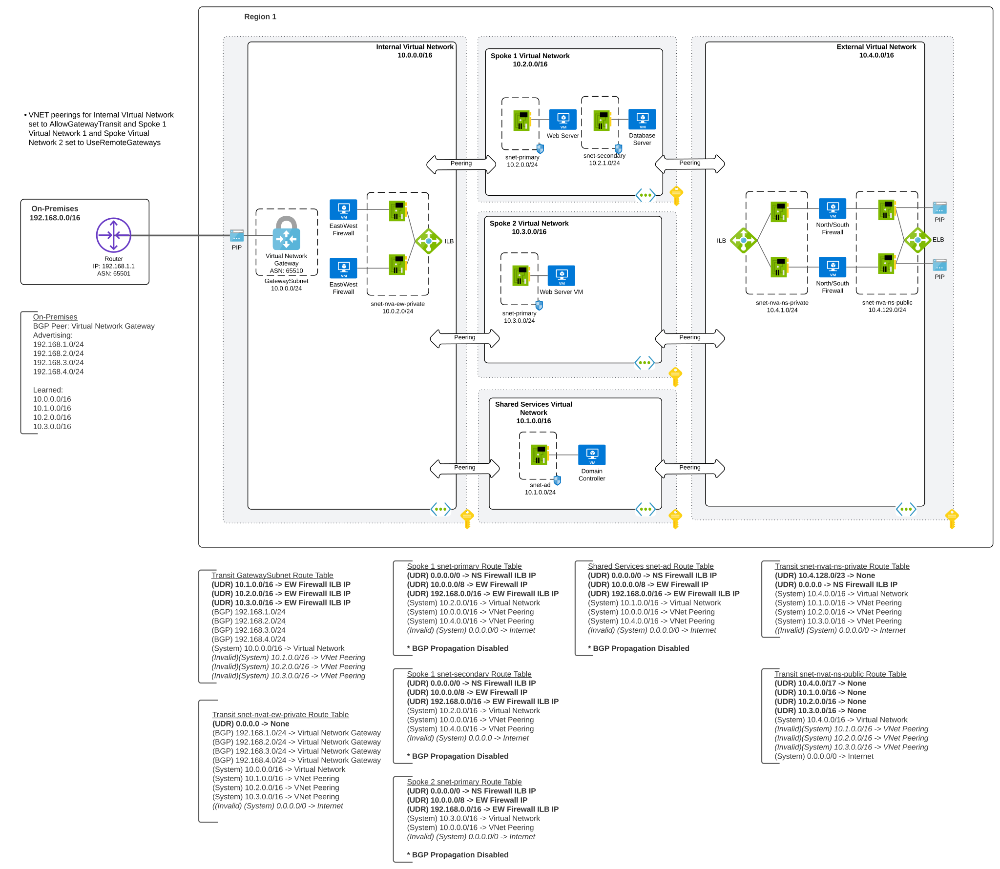

In this pattern there is a dedicated virtual network used for on-premises connectivity (Internal Virtual Network) and a second dedicated virtual network for Internet connectivity (External Virtual Network). Workloads each have a dedicated virtual network and are dual peered to both Internal Virtual Network and External Virtual Network.There is requirement for Internet-bound traffic, traffic between on-premises and Azure, and traffic between workloads in Azure to be mediated, inspected, and/or centrally logged by firewalls in Azure. There is a separate firewall stack for north/south traffic in the External Virtual Network and another for east/west in the Internal Virtual Network.

This pattern also uses a dedicated virtual network in a dedicated subscription for shared infrastructure services. These services can include Microsoft Active Directory, patching or update services, or logging services.

The pattern is complex and should only be used where there is a hard requirement to establish separate subscription-level boundaries and blast radiuses for east/west and north/south traffic. It should not used for the purposes of replicating traditional on-premises DMZ architectures. The previous two architectures can establish a DMZ-like architecture in a single virtual network.

*Benefits*
* North/south and east/west firewall have separate subscription-level blast radiuses.
* North/south and east/west traffic is distributed to two separate firewall stacks reducing the risk of a bottleneck.
* Traffic between the north/south public subnet and private subnet interfaces is blackholed creating a DMZ-like configuration.
* Traffic between the north/south public and private interfaces is blackholed to create a DMZ-like configuration.
* All Internet-bound traffic is egressed directly out of Azure reducing networking complexity.
* Shared infrastructure services added to Azure reduce the for workloads to go back on-premises for these services reducing network costs, latency, and mitigate impact of lost connectivity to on-premises.
* Shared infrastructure services have a dedicated subscription containing its own virtual network and resources creating a separate blast radius.
* Workloads have dedicated subscriptions containing their virtual network and workload resources creating separate blast radiuses.
* The on-premises connectivity and network security appliances resources are in a dedicated subscription creating a separate blast radius.
* All virtual machines in the separate peered virtual networks can communicate with each other through the Virtual Network Gateway (VPN) or MSEE (Microsoft Enterprise Edge) router (ExpressRoute).
* On-premises connectivity is provided by a Virtual Network Gateway configured with either a site-to-site VPN or ExpressRoute connection. Routes can be exchanged between on-premises and Azure using BGP.
* Virtual machine communication between subnets in the separate peered virtual networks can be mediated with network security groups.
* All virtual machines in the same virtual network can communicate with each other using default system routes.
* Virtual machine communication between subnets in the same virtual network can be mediated with network security groups.

*Considerations*
* Snowflake pattern that introduces additional complexity for limited security benefits for most organizations.
* Carving out IP address blocks for Azure must be well planned to avoid frequent changes to static routes.
* Routing can become complex.
* Additional costs of running multiple sets of firewalls.

### VWAN - Single Region VWAN Hub
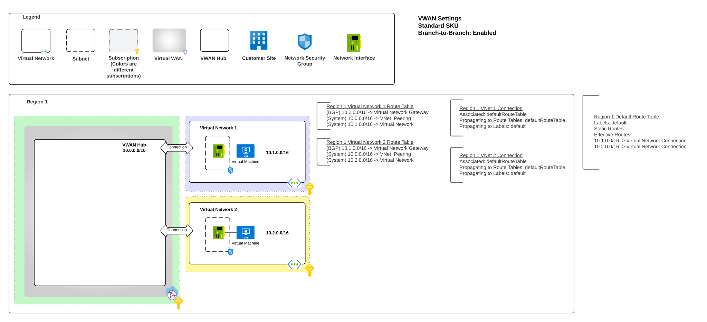

In this pattern there is a VWAN with a hub in a single region with connections to two virtual networks. 

*Benefits*
* Intra-hub virtual networks can communicate with each other by default.

*Considerations*
* All resources in Azure have direct access to the Internet through the default system route.
* Mediation between intra-hub virtual networks is done with Network Security Groups.

### VWAN - Single Region VWAN Hub With Single Branch
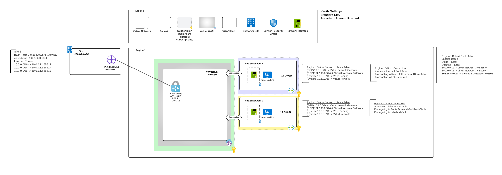

In this pattern there is a VWAN with a hub in a single region with connections to two virtual networks. A single branch site is connected to the hub.

*Benefits*
* Intra-hub virtual networks can communicate with each other by default.
* Branch sites can communicate with intra-hub virtual networks by default.

*Considerations*
* All resources in Azure have direct access to the Internet through the default system route.
* Mediation between intra-hub virtual networks is done with Network Security Groups.
* Mediation between branch sites and virtual networks is done with Network Security Groups and optional on-premises security appliances.

### VWAN - Single Region VWAN Hub With Multiple Branches
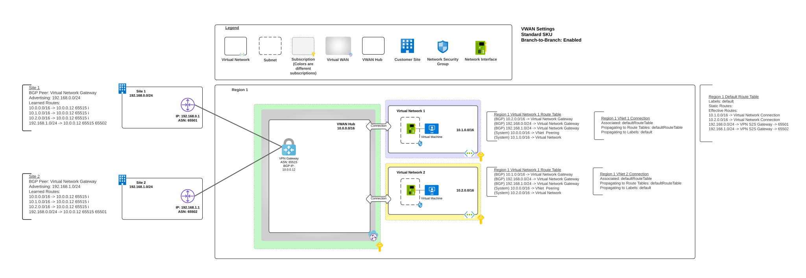

In this pattern there is a VWAN with a hub in a single region with connections to two virtual networks. Multiple branch sites are connected to the hub.

*Benefits*
* Intra-hub virtual networks can communicate with each other by default.
* Branch sites can communicate with intra-hub virtual networks by default.
* Branch sites can communicate with other branch sites by default.

*Considerations*
* All resources in Azure have direct access to the Internet through the default system route.
* Mediation between intra-hub virtual networks is done with Network Security Groups.
* Mediation between branch sites and virtual networks is done with Network Security Groups and optional on-premises security appliances.
* Mediation between branch sites is done with on-premises firewalls.

### VWAN - Multiple Region VWAN Hubs With Multiple Branches Connected to a Single Hub
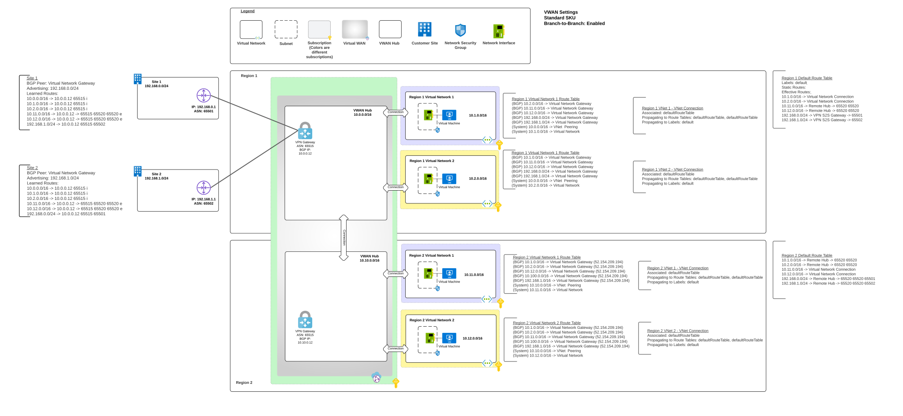

In this pattern there are multiple VWAN Hubs in separate regions. Each hub is connected to multiple virtual networks within the region.

Branch sites are connected to a hub in a single region to allow connectivity to the virtual networks in both regions using the VWAN cross hub connectivity.

*Benefits*
* Intra-hub virtual networks can communicate with each other by default.
* Inter-hub virtual networks can communicate with each other by default.
* Branch sites can communicate with intra-hub virtual networks by default.
* Branch sites can communicate with other branch sites by default.
* Branch sites can comunicate with inter-hub virtual networks by default.

*Considerations*
* All resources in Azure have direct access to the Internet through the default system route.
* Mediation between intra-hub and inter-hub virtual networks is done with Network Security Groups.
* Mediation between branch sites and virtual networks both intra-hub and inter-hub is done with Network Security Groups and optional on-premises security appliances.
* Mediation between branch sites is done with on-premises firewalls.
* Loss of connectivity from the branch sites to the hub the site is connected to results in loss of connectivity to Azure.

### VWAN - Multiple Region VWAN Hubs With Multiple Branches Connected to Multiple Hubs
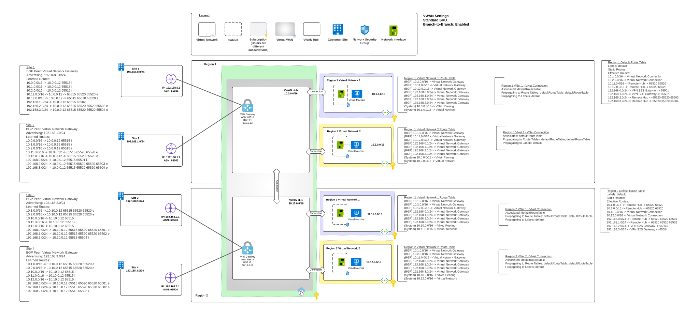

This is an appropriate pattern for organizations that want any-to-any connectivity out of the box. It allows for connectivity between branches and virtual networks, including across regions.

It is not appropriate for organizations that require centralized mediation and/or inspection using an NVA (network virtual appliance).

*Benefits*
* Intra-hub virtual networks can communicate with each other by default.
* Inter-hub virtual networks can communicate with each other by default.
* Branch sites can communicate with intra-hub virtual networks by default.
* Branch sites can communicate with other branch sites by default both intra-hub and inter-hub.
* Branch sites can comunicate with inter-hub virtual networks by default.

*Considerations*
* All resources in Azure have direct access to the Internet through the default system route.
* Mediation between intra-hub and inter-hub virtual networks is done with Network Security Groups.
* Mediation between branch sites and virtual networks both intra-hub and inter-hub is done with Network Security Groups and optional on-premises security appliances.
* Mediation between branch sites is done with on-premises firewalls.
* Loss of connectivity from the branch sites to the hub the site is connected to results in loss of connectivity to Azure.

### VWAN - Multiple Region VWAN Hubs With Multiple Branches Connected to Multiple Hubs For Redundancy
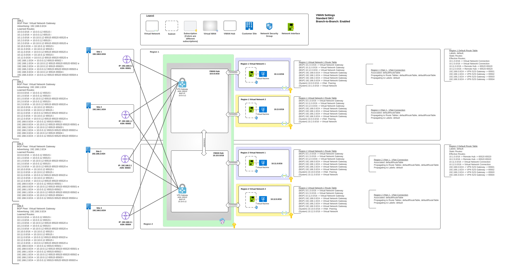

This is an appropriate pattern for organizations that want any-to-any connectivity out of the box. It allows for connectivity between branches and virtual networks, including across regions. Branch sites also have redundancy to their connectivity in Azure in the instance an Azure region were to become unavailable.

It is not appropriate for organizations that require centralized mediation and/or inspection using an NVA (network virtual appliance).

*Benefits*
* Intra-hub virtual networks can communicate with each other by default.
* Inter-hub virtual networks can communicate with each other by default.
* Branch sites can communicate with intra-hub virtual networks by default.
* Branch sites can communicate with other branch sites by default both intra-hub and inter-hub.
* Branch sites can comunicate with inter-hub virtual networks by default.
* Local preferences can be applied to routes advertised from VWAN Hub to branch sites to prefer a specific connection.
* If connectivity from a branch site to a hub is lost, connectivity to Azure will still be possible using the connection to the other hub.

*Considerations*
* All resources in Azure have direct access to the Internet through the default system route.
* Mediation between intra-hub and inter-hub virtual networks is done with Network Security Groups.
* Mediation between branch sites and virtual networks both intra-hub and inter-hub is done with Network Security Groups and optional on-premises security appliances.
* Mediation between branch sites is done with on-premises firewalls.

### VWAN - Multiple Region VWAN Secure Hubs with Multiple Branches Connected to Multiple Hubs for Redundancy and North and South Firewall using Routing Policies
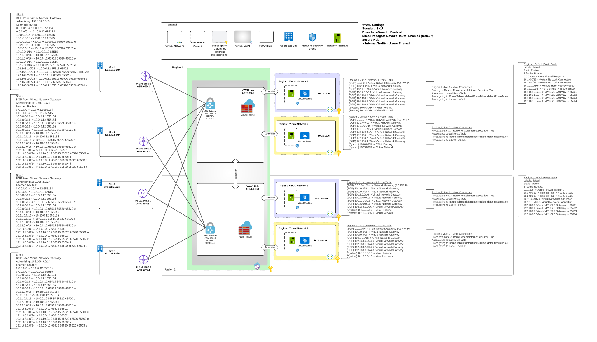

This pattern is **not** recommended for production because it uses the public preview feature of [routing policies](https://docs.microsoft.com/en-us/azure/firewall-manager/secured-virtual-hub#gated-public-preview). 

In this pattern, north and south traffic is automatically routed through Azure Firewall or a [compatible NVA (network virtual appliance)](https://docs.microsoft.com/en-us/azure/virtual-wan/about-nva-hub) that is deployed into each VWAN hub using the [Secure Hub feature](https://docs.microsoft.com/en-us/azure/firewall-manager/secured-virtual-hub). Traffic can be centrally mediated and/or inspected.

*Benefits*
* Intra-hub virtual networks can communicate with each other by default.
* Inter-hub virtual networks can communicate with each other by default.
* Branch sites can communicate with intra-hub virtual networks by default.
* Branch sites can communicate with other branch sites by default both intra-hub and inter-hub.
* Branch sites can comunicate with inter-hub virtual networks by default.
* Local preferences can be applied to routes advertised from VWAN Hub to branch sites to prefer a specific connection.
* If connectivity from a branch site to a hub is lost, connectivity to Azure will still be possible using the connection to the other hub.
* Traffic to the Internet from the attached virtual networks (and optionally sites) is routed through a supported appliance in the hub for mediation and/or inspection.

*Considerations*
* Mediation between intra-hub and inter-hub virtual networks is done with Network Security Groups.
* Mediation between branch sites and virtual networks both intra-hub and inter-hub is done with Network Security Groups and optional on-premises security appliances.
* Mediation between branch sites is done with on-premises firewalls.
* Static routes on default route tables are not supported.
* Propagate default route is enabled by default on branch site connections.

## VWAN - Multiple Region VWAN Secure Hubs with Multiple Branches Connected to Multiple Hubs for Redundancy and North South East West Firewall Using Routing Policies
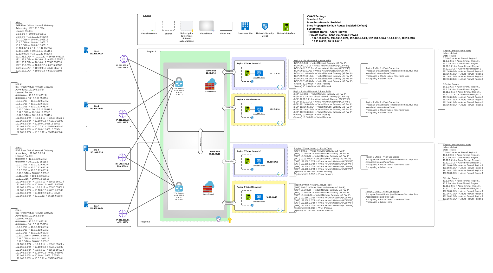

This pattern is **not** recommended for production because it uses the public preview feature of [routing policies](https://docs.microsoft.com/en-us/azure/firewall-manager/secured-virtual-hub#gated-public-preview). 

In this pattern, north and south traffic is automatically routed through Azure Firewall or a [compatible NVA (network virtual appliance)](https://docs.microsoft.com/en-us/azure/virtual-wan/about-nva-hub) that is deployed into each VWAN hub using the [Secure Hub feature](https://docs.microsoft.com/en-us/azure/firewall-manager/secured-virtual-hub). Additionally, east and west traffic intra-hub is also automatically routed through the appliance in the hub. Traffic can be centrally mediated and/or inspected.

The major drawback of this pattern is inter-hub traffic between virtual networks or branches connected to different hubs in separate regions is not possible. As of March 2022 this a [VWAN limitation](https://docs.microsoft.com/en-us/azure/firewall-manager/overview#known-issues).

*Benefits*
* Intra-hub virtual networks can communicate with each other by default.
* Branch sites can communicate with intra-hub virtual networks by default.
* Branch sites can communicate with other branch sites by default intra-hub..
* Local preferences can be applied to routes advertised from VWAN Hub to branch sites to prefer a specific connection.
* If connectivity from a branch site to a hub is lost, connectivity to the hub virtual networks the branch still has connection to will still be possible.
* Traffic to the Internet from the attached virtual networks (and optionally sites) is routed through a supported appliance in the hub for mediation and/or inspection.
* Traffic to and from the branch and virtual network intra-hub is routed through a supported appliance in the hub for mediation and/or inspection.

*Considerations*
* Inter-hub virtual networks cannot communicate with each other.
* Branch sites not connected to the same hub cannot communicate with each other.
* Mediation between branch sites is done with on-premises firewalls.
* Static routes on default route tables are not supported.
* Propagate default route is enabled by default on branch site connections.
* Loss of connectivity of a branch site to a hub prevents that branch site from connecting to virtual networks in that hub.

## VWAN - Multiple Region VWAN Secure Hubs with Multiple Branches Connected to Multiple Hubs for Redundancy and North South East West Firewall Using Custom Routing - Option 1
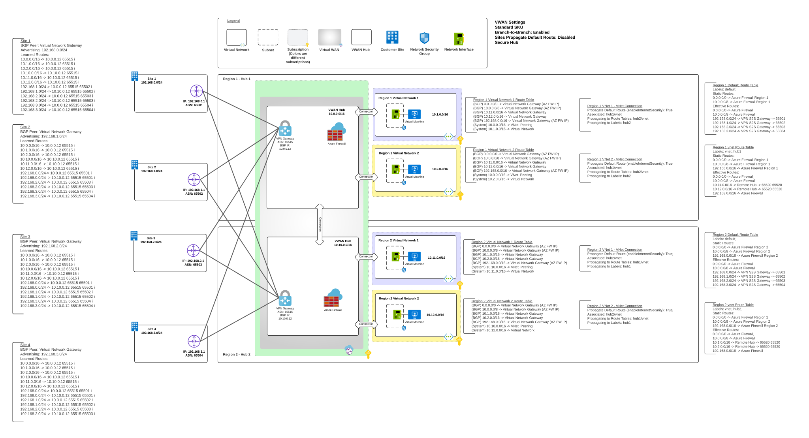

This pattern provides some support for central mediation and/or inspection for north/south and some east west traffic including branch-to-virtual network and virtual network-to-virtual network within the same hub. Inter-hub traffic is not centrally mediated and/or inspected due to a [VWAN limitation](https://docs.microsoft.com/en-us/azure/firewall-manager/overview#known-issues).

Custom routing is used to route the supported traffic through an Azure Firewall or a [compatible NVA (network virtual appliance)](https://docs.microsoft.com/en-us/azure/virtual-wan/about-nva-hub) is deployed into each VWAN hub using the [Secure Hub feature](https://docs.microsoft.com/en-us/azure/firewall-manager/secured-virtual-hub). This avoids the use of [routing policies](https://docs.microsoft.com/en-us/azure/firewall-manager/secured-virtual-hub#gated-public-preview) which are still in preview.

One major consideration of this pattern is loss of direct connectivity of a branch site to a hub in one region results in the loss of connectivity to virtual networks within that hub. This is again the result of the [VWAN limitation](https://docs.microsoft.com/en-us/azure/firewall-manager/overview#known-issues).

*Benefits*
* Intra-hub virtual networks can communicate with each other by default.
* Inter-hub virtual networks can communicate with each other by default.
* Branch sites can communicate with intra-hub virtual networks by default.
* Branch sites can communicate with inter-hub virtual networks by default.
* Local preferences can be applied to routes advertised from VWAN Hub to branch sites to prefer a specific connection.
* If connectivity from a branch site to a hub is lost, connectivity to the hub virtual networks the branch still has connection to will still be possible.
* Traffic to the Internet from the attached virtual networks (and optionally sites) is routed through a supported appliance in the hub for mediation and/or inspection.
* Traffic to and from the branch and virtual network intra-hub is routed through a supported appliance in the hub for mediation and/or inspection.

*Considerations*
* Mediation between branch sites is done with on-premises firewalls.
* Static routes on default route tables are not supported.
* Propagate default route is enabled by default on branch site connections.
* Loss of connectivity of a branch site to a hub prevents that branch site from connecting to virtual networks in that hub.
* Traffic between inter-hub virtual networks is not mediated and/or inspected by a supported appliance in the hub due to a [VWAN limitation](https://docs.microsoft.com/en-us/azure/firewall-manager/overview#known-issues).

## VWAN - Multiple Region VWAN Secure Hubs with Multiple Branches Connected to Multiple Hubs for Redundancy and North South East West Firewall Using Custom Routing - Option 2
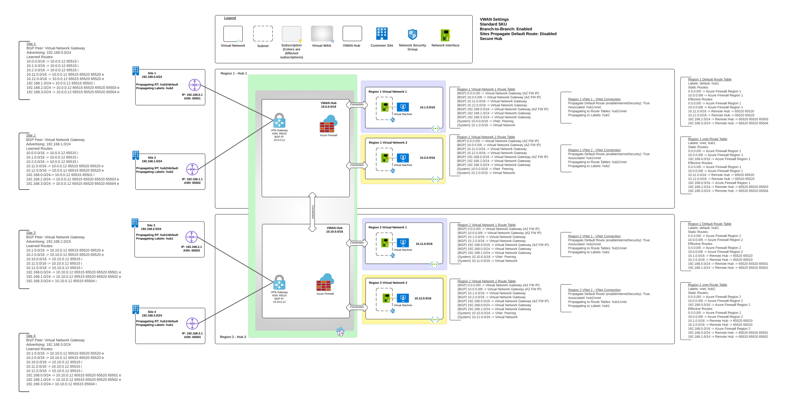

This pattern is a variation of [option 1](#vwan---multiple-region-vwan-secure-hubs-with-multiple-branches-connected-to-multiple-hubs-for-redundancy-and-north-south-east-west-firewall-using-custom-routing---option-1). It is described in detail in [excellent blog post by Jose Moreno](https://blog.cloudtrooper.net/2020/11/17/virtual-wan-secure-hubs-in-multiple-regions/). The difference in this pattern is that branches are connected to single hub. It provides some support for central mediation and/or inspection for north/south and some east west traffic including branch-to-virtual network and virtual network-to-virtual network within the same hub. Inter-hub traffic is not centrally mediated and/or inspected due to a [VWAN limitation](https://docs.microsoft.com/en-us/azure/firewall-manager/overview#known-issues).

Custom routing is used to route the supported traffic through an Azure Firewall or a [compatible NVA (network virtual appliance)](https://docs.microsoft.com/en-us/azure/virtual-wan/about-nva-hub) is deployed into each VWAN hub using the [Secure Hub feature](https://docs.microsoft.com/en-us/azure/firewall-manager/secured-virtual-hub). This avoids the use of [routing policies](https://docs.microsoft.com/en-us/azure/firewall-manager/secured-virtual-hub#gated-public-preview) which are still in preview.

One major consideration of this pattern is loss of direct connectivity of a branch site to the hub it is connected to results in loss of connectivity to Azure.

*Benefits*
* Intra-hub virtual networks can communicate with each other by default.
* Inter-hub virtual networks can communicate with each other by default.
* Branch sites can communicate with intra-hub virtual networks by default.
* Branch sites can communicate with inter-hub virtual networks by default.
* Local preferences can be applied to routes advertised from VWAN Hub to branch sites to prefer a specific connection.
* If connectivity from a branch site to a hub is lost, connectivity to the hub virtual networks the branch still has connection to will still be possible.
* Traffic to the Internet from the attached virtual networks (and optionally sites) is routed through a supported appliance in the hub for mediation and/or inspection.
* Traffic to and from the branch and virtual network intra-hub is routed through a supported appliance in the hub for mediation and/or inspection.

*Considerations*
* Mediation between branch sites is done with on-premises firewalls.
* Static routes on default route tables are not supported.
* Propagate default route is enabled by default on branch site connections.
* Loss of connectivity of a branch site to the hub it is connected to results in loss of connectivity to Azure.
* Traffic between inter-hub virtual networks is not mediated and/or inspected by a supported appliance in the hub due to a [VWAN limitation](https://docs.microsoft.com/en-us/azure/firewall-manager/overview#known-issues).